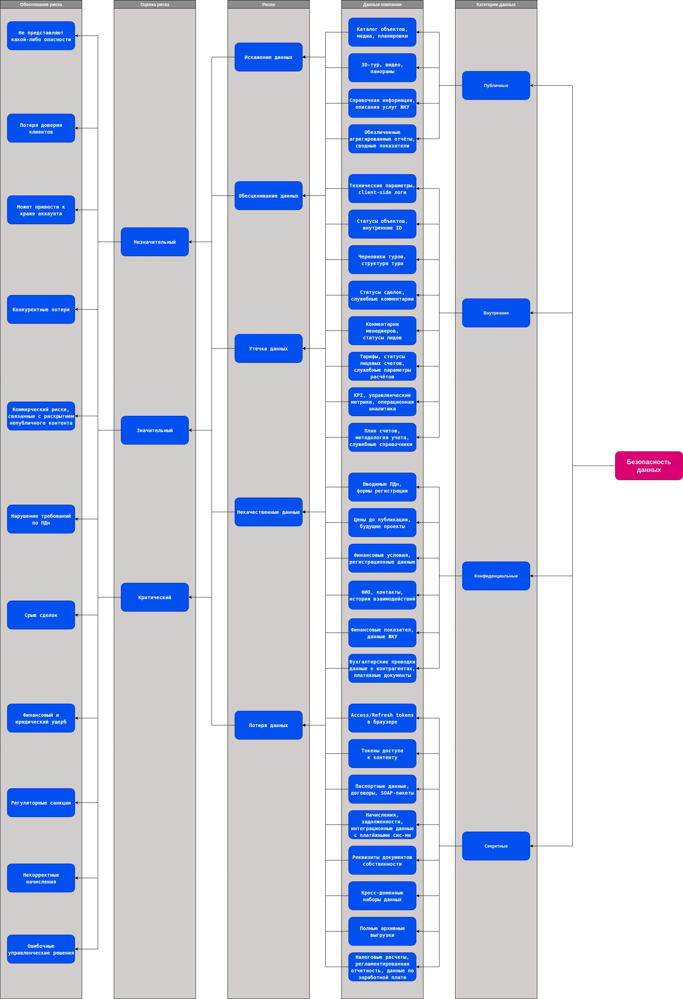

# Задание 1. Разработка проверочного листа по безопасности данных

Ниже в документе приведен результат выполнения задания, в котором для каждой группы сервисов (Продажи, ЖКУ, Финансы, Дата) будет проведена классификация данных, с которыми работает компания по стандартам ISO/IEC 27001 и 27002. Определены риски для каждой категории данных. Дана оценка рисков и приведено объяснение его актуальности. В заключении будет создан mindmap для физуализации результатов.

Напомним, что согласно ISO/IEC 27001 и 27002 данные можно разделить на 

* Публичные данные — информация, которая не подлежит ограничению. Данные могут быть свободно распространены и не представляют угрозы для компании. Например, пресс-релизы или публичная информация на сайте.
* Внутренние данные — информация для внутреннего использования в организации. Например, внутренние инструкции, отчёты или данные о работе внутренних систем.
* Конфиденциальные данные — информация, которая имеет высокую ценность и ограничена в распространении. Например, персональные данные, финансовая информация или коммерческая тайна.
* Секретные данные — информация, Утечка данных которой может привести к самым серьёзным последствиям для организации или нарушению законодательства. Например, платёжные данные или государственная тайна.

При для каждой категории будем проводить анализ на наличие следующих рисков:

* Утечка данных.
* Потеря данных.
* Искажение данных.
* Некачественные данные.
* Обесценивание данных.

При проведении оценки рисков будем использовать шкалу

* Незначительный.
* Значительный.
* Критический.

---

## Группа сервисов продаж

### Витрина продаж

> Витрина продаж представляет собой пользовательский интерфейс и публичную точку входа в экосистему PropDevelopment, обеспечивающую отображение информации и передачу персональных и аутентификационных данных клиентов во внутренние сервисы.

| Категория | Данные | Риски | Оценка | Обоснование |
|---|---|---|---|---|
| Публичные | Каталог объектов, медиа | Искажение данных | Значительный | Потеря доверия клиентов |
| Внутренние | Технические параметры, client-side логи | Утечка данных | Незначительный | Не представляют какой-либо опасности |
| Конфиденциальные | Вводимые ПДн, формы регистрации | Утечка данных | Значительный | Утечка клиентских данных, например в следствии XSS |
| Секретные | Access/Refresh tokens в браузере | Утечка данных | Критический | Может привести к краже аккаунта |

### client-mart-estate-app

> client-mart-estate-app является доменным сервисом, предназначенным для хранения и управления мастер-данными об объектах недвижимости. Сервис содержит структурированную информацию о характеристиках объектов, проектах, ценах и маркетинговом контенте и не обрабатывает персональные данные клиентов.

| Категория | Данные | Риски | Оценка | Обоснование |
|---|---|---|---|---|
| Публичные | Каталог объектов, фото, планировки | Искажение данных Обесценивание данных | Значительный Незначительный | Подмена контента вводит клиентов в заблуждениеи влияние на решения |
| Внутренние | Статусы объектов, внутренние ID | Утечка данных | Значительный | Раскрытие планов и преждевременное раскрытие информации о продажах |
| Конфиденциальные | Цены до публикации, будущие проекты | Утечка данных Потеря данных  | Критический Значительный  | Конкурентные потери |
| Секретные | — | — | — | Не обрабатываются |

### client-tour-app

> client-tour-app предназначен для хранения и предоставления мультимедийного контента онлайн-туров по объектам недвижимости. Сервис обрабатывает публичные и внутренние данные о турах, а также ограниченный объём псевдонимизированных пользовательских данных, связанных с аналитикой использования сервиса.

| Категория | Данные | Риски | Оценка | Обоснование |
|---|---|---|---|---|
| Публичные | 3D‑тур, видео, панорамы| Искажение данных Обесценивание данных | Значительный Незначительный | Подмена контента вводит клиентов в заблуждениеи влияние на решения |
| Внутренние | Черновики туров, структура тура| Утечка данных | Значительный | Коммерческий риски, связанные с раскрытием непубличного контента|
| Конфиденциальные | Аналитика поведения, session_id | Утечка данных | Значительный | Нарушение требований по ПДн |
| Секретные | Токены доступа к контенту | Утечка данных | Критический | Захват аккаунтов, несанкционированный доступ |

### client-mart-app

> client-mart-app является критически важным приложением, обеспечивающим проведение онлайн-сделок по покупке недвижимости. Сервис обрабатывает персональные данные клиентов, юридически значимые документы, финансовую и регистрационную информацию и взаимодействует с государственными регистрационными органами.

| Категория | Данные | Риски | Оценка | Обоснование |
|---|---|---|---|---|
| Публичные | — | — | — | Не используются |
| Внутренние | Статусы сделок, служебные комментарии | Искажение данных | Значительный | Срыв сделок |
| Конфиденциальные | Финансовые условия, регистрационные данные | Утечка данных | Критический | Финансовый и юридический ущерб |
| Секретные | Паспортные данные, договоры, SOAP-пакеты | Утечка данных Искажение данных | Критический | Регуляторные санкции Юридическая недействительность сделки |

### client-crm-app

> client-crm-app представляет собой систему управления клиентскими данными и является основным хранилищем персональных данных клиентов компании. Сервис обрабатывает идентификационные, контактные, регистрационные и поведенческие данные клиентов.

| Категория | Данные | Риски | Оценка | Обоснование |
|---|---|---|---|---|
| Публичные | — | — | — | Не используются |
| Внутренние | Комментарии менеджеров, статусы лидов | Искажение данных | Значительный | Ошибки в работе с клиентом |
| Конфиденциальные | ФИО, контакты, история взаимодействий | Утечка данных Некачественные данные | Критический Значительный | Нарушение законодательства о ПДн Ошибки при работе с клиентами |
| Секретные | Паспортные данные, идентификаторы документов | Утечка данных Потеря данных | Критический  | Регуляторные санкции Юридическая недействительность сделки<Срыв сделок> |

---

## Группа сервисов ЖКУ

### Витрина сервисов ЖКУ

>Витрина сервисов для собственников является пользовательским интерфейсом и публичной точкой доступа к сервисам ЖКУ. Система обеспечивает отображение персонализированной информации собственников, сбор и передачу персональных, финансовых и аутентификационных данных во внутренние сервисы. 

| Категория | Данные | Риски | Оценка | Обоснование |
|---|---|---|---|---|
| Публичные | Справочная информация, описания услуг ЖКУ | Искажение данных | Значительный | Потеря доверия собственников |
| Внутренние | Client-side логи, технические параметры сессий | Утечка данных | Незначительный | Ограниченный ущерб |
| Конфиденциальные | ФИО, адрес, лицевой счёт, обращения собственников | Утечка данных | Значительный | Юрибические и репутационные последствия |
| Секретные | Access / refresh токены, session id | Утечка данных | Критический Критический | Может привести к краже аккаунтов |

### tenant-core-app

>tenant-core-app является ключевым сервисом группы ЖКУ и предназначен для предоставления коммунальных услуг собственникам недвижимости. Сервис обрабатывает персональные данные собственников, данные о лицевых счетах, начислениях, платежах и взаимодействует с внешними поставщиками ресурсов и платёжными системами. 

| Категория | Данные | Риски | Оценка | Обоснование |
|---|---|---|---|---|
| Публичные | Описания услуг ЖКУ, справочная информация | Искажение данных | Значительный | Вводит собственников в заблуждение |
| Внутренние | Тарифы, статусы лицевых счетов, служебные параметры расчётов | Искажение данных Утечка данных | Значительный | Некорректные начисления Раскрытие бизнес логики |
| Конфиденциальные | ФИО, контакты собственников, данные по объектам | Утечка данных Некачественные данные | Критический Значительный | Нарушение законодательства о ПДн Ошибки обслуживания |
| Секретные | Начисления, задолженности, интеграционные данные с платёжными системами и поставщиками ЖКХ | Утечка данных Искажение данных Потеря данных | Критический Критический Значительный | Финансовый и репутационный ущерб Неверные обязательства |

### CRM

>CRM группы сервисов ЖКУ предназначена для управления данными собственников недвижимости и является основным хранилищем персональных и имущественных данных в контуре эксплуатации. Система обрабатывает идентификационные, контактные, регистрационные и операционные данные собственников, а также историю взаимодействий с ними. 

| Категория | Данные | Риски | Оценка | Обоснование |
|---|---|---|---|---|
| Публичные | — | — | — | Не используются |
| Внутренние | Служебные комментарии менеджеров, статусы обращений  | Искажение данных Некачественные данные | Значительный | Ошибки при работе с обращениями |
| Конфиденциальные |  ФИО, контакты, данные о собственности | Утечка данных Потеря данных | Критический Значительный | Нарушение законодательства о ПДн Невозможность сопровождения собственников |
| Секретные | Чувствительные обращения, реквизиты документов собственности | Утечка данных Искажение данных| Критический Критический Значительный | Юридические и репутационные последствия |

---

## Хранилище данных

### DWH (Greenplum)

> Хранилище данных (Greenplum) предназначено для централизованного хранения и аналитической обработки данных, поступающих из ключевых информационных систем компании, включая сервисы продаж и жилищно-коммунального хозяйства (ЖКУ). Хранилище аккумулирует персональные, финансовые, поведенческие и коммерческие данные, используемые для бизнес-аналитики и управленческой отчётности.

| Категория данных | Описание | Основные риски |
|------------------|----------|----------------|
| Публичные| Обезличенные агрегированные отчёты, сводные показатели | Искажение данных Обесценивание данных |  Значительный Незначительный | Ошибочные управленческие решения |
| Внутренние| KPI, управленческие метрики, операционная аналитика | Утечка данных Искажение данных Некачественные данные | Значительный | Раскрытие стратегии компании  Искажённая картина бизнеса |
| Конфиденциальные | Персональные данные клиентов и собственников, финансовые показатели, данные ЖКУ | Утечка данных Потяря данных Некачественные данные | Критический Значительный | Нарушение законодательства о ПДн, финансовые и репутационные потери<brУтрата аналитической истории |
| Секретные | Кросс-доменные наборы данных (CRM + сделки + ЖКУ), расширенные профили клиентов | Утечка данных Искажение данных Потеря данных | Критический | Раскрытие профилей Неверные стратегические решения |

### DWH (S3)

> Хранилище данных (S3) предназначено для физического и долговременного хранения аналитических данных, поступающих из корпоративного хранилища данных.  
Система содержит исторические, персональные, финансовые и поведенческие данные, используемые для аналитики, архивирования и резервного хранения.

| Категория | Данные | Риски | Оценка | Обоснование |
|----------|--------|-------|--------|-------------|
| Публичные | Агрегированные обезличенные датасеты и отчёты | Искажение данных обесценивание данных | Значительный | Искажение публичных агрегированных данных может привести к ошибочным аналитическим выводам, при этом утрата актуальности не оказывает критического влияния на бизнес |
| Внутренние | Управленческие датасеты, KPI, исторические витрины данных | Утечка данных Потеря данных Некачественные данные | Значительный | Нарушение конфиденциальности, утрата или снижение качества внутренних данных негативно влияет на управленческие решения и конкурентные преимущества |
| Конфиденциальные | Архивные персональные данные, финансовые показатели, начисления и платежи | Утечка данных Потеря данных Искажение данных | Критический | Утечка персональных и финансовых данных приводит к регуляторным, финансовым и репутационным потерям, а также нарушению требований законодательства |
| Секретные | Полные архивные выгрузки, кросс-доменные исторические наборы данных | Утечка данных Потеря данных Искажение данных | Критический | Высокая концентрация и корреляция данных создаёт риск полного раскрытия информации и принятия неверных стратегических решений |

---

## Бухгалтерия

### accountant-service-1

> accountant-service-1 является системой бухгалтерского учета и предназначен для ведения финансового и регламентированного учета компании. Сервис обрабатывает финансовые данные, сведения о контрагентах, налоговую отчетность и персональные данные сотрудников.

| Категория | Данные | Риски | Оценка | Обоснование |
|----------|--------|-------|--------|-------------|
| Публичные | — | — | — | Не используются |
| Внутренние | План счетов, методология учета, служебные справочники | Искажение данных Некачественные данные | Значительный | Ошибки в учетных данных и справочниках приводят к некорректным бухгалтерским проводкам и искажению финансового учета |
| Конфиденциальные | Бухгалтерские проводки, данные о контрагентах, платежные документы | Утечка данных Потеря данных Искажение данных | Критический | Нарушение конфиденциальности или целостности финансовых данных влечет существенный финансовый и репутационный ущерб |
| Секретные | Налоговые расчеты, регламентированная отчетность, данные по заработной плате сотрудников | Утечка данных Потеря данных Искажение данных | Критический | Утечка или искажение налоговых и персональных данных приводит к регуляторным санкциям, юридической ответственности и нарушению законодательства о ПДн |

---

## 5. Аутентификация

### 5. auth-service-1

> auth-service-1 является сервисом аутентификации покупателей и обеспечивает регистрацию и проверку подлинности пользователей онлайн-витрины. Сервис обрабатывает идентификационные и аутентификационные данные пользователей, включая учетные записи, хеши паролей и токены доступа.

| Категория | Данные | Риски | Оценка | Обоснование |
|----------|--------|-------|--------|-------------|
| Публичные | — | — | — | Не используются |
| Внутренние | Логи аутентификации | Утечка информации | Значительный | Компрометация логов аутентификации может привести к косвенной информации о поведении пользователей и атакам на учетные записи |
| Конфиденциальные | Адрес электронной почты, номер телефона, IP-адрес пользователя | Утечка информации | Значительный | Нарушение конфиденциальности персональных данных пользователей приводит к нарушениям требований privacy и регуляторным рискам |
| Секретные | Хеши паролей, refresh-токены, токены доступа | Утечка данных Искажение данных | Критический | Компрометация аутентификационных данных приводит к полному захвату учетных записей и несанкционированному доступу к системе |

# MindMap Безопасность данных

Ниже представлен MindMap для поверочного листа, который разбирался выше в разделах.

