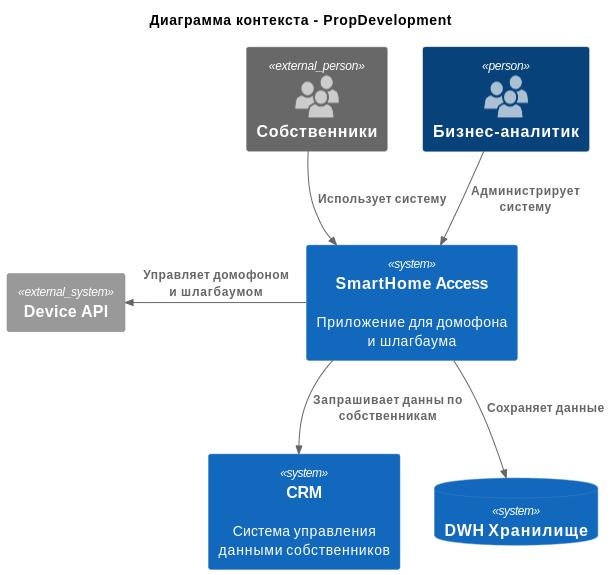
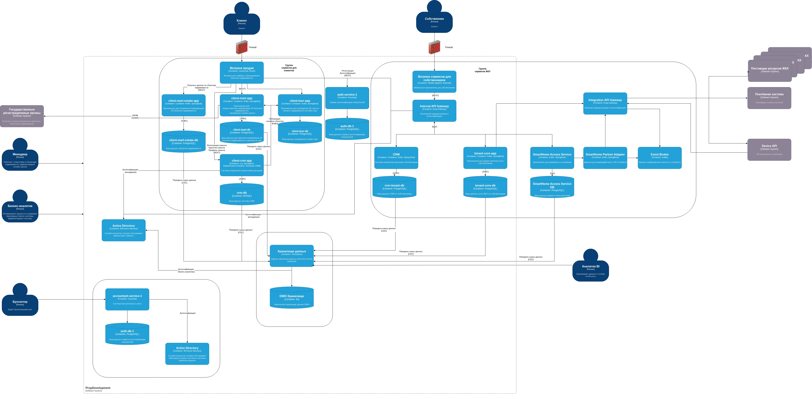

# Диаграмма контекста в модели С4

# Диаграмма контейнеров PropDevelopment

# Требования к внешним интеграциям

В рамках внедрения сервисов «Интеллектуальный домофон» и «Интеллектуальный шлагбаум» PropDevelopment планирует интеграцию с внешней платформой партнёра, предоставляющего функции управления устройствами «умного дома». Для снижения рисков информационной безопасности, повышения управляемости архитектуры и подготовки к аудиту безопасности формируется единый набор требований к таким интеграциям.

## 1. Требования к безопасности внешних интеграций

### 1.1 Централизованный контур интеграций

Все взаимодействия с внешними системами должны осуществляться исключительно через Integration API Gateway. Прямые вызовы внутренних сервисов PropDevelopment во внешние системы запрещены. Аналогично, все входящие сообщения и события от внешней платформы принимаются только через Integration API Gateway.

Данный подход позволяет централизовать контроль безопасности, упростить аудит интеграций и исключить несанкционированный обмен данными.

### 1.2 Защита транспортного уровня

Взаимодействие между Integration API Gateway и внешней платформой должно осуществляться по защищённому каналу с использованием протокола TLS версии не ниже 1.2. Для сервер-серверных интеграций рекомендуется применение взаимной аутентификации по сертификатам (mTLS).

### 1.3 Контроль передаваемых данных и минимизация персональных данных

Передача данных во внешние системы должна осуществляться в соответствии с принципом минимизации данных. Во внешние API передаются только те данные, которые необходимы для выполнения конкретной бизнес-функции.

Обработка биометрических данных осуществляется исключительно на стороне партнёрской платформы. Системы PropDevelopment не хранят и не обрабатывают фотографии лиц или биометрические шаблоны, а получают только результат распознавания в виде признака успешного или неуспешного доступа и соответствующих идентификаторов.

### 1.4 Валидация контрактов и защита от некорректных данных

Все входящие и исходящие сообщения должны проходить обязательную валидацию на Integration API Gateway и/или в адаптере партнёра. Валидация включает проверку структуры сообщений, обязательных полей, типов данных и допустимых значений.

Контракты внешних API должны быть версионированы. Изменения контрактов должны выполняться с обеспечением обратной совместимости либо в рамках согласованной миграции.

### 1.5 Аудит и мониторинг

Все интеграционные операции подлежат обязательному логированию и аудиту. В журналах фиксируются инициатор операции, тип операции, объект доступа, результат выполнения и корреляционный идентификатор для сквозной трассировки.

Интеграция должна поддерживать мониторинг показателей доступности, ошибок и времени отклика, а также механизмы оперативного отключения партнёрских интеграций в случае инцидентов безопасности.

### 1.6 Устойчивость и защита от повторных запросов

Команды управления устройствами должны быть идемпотентными. Входящие события должны поддерживать дедупликацию и защиту от повторной доставки. Для повышения устойчивости используются таймауты, повторные попытки и ограничение частоты запросов.

---

## 2. Протоколы аутентификации и авторизации

Для аутентификации и авторизации при взаимодействии с внешней платформой применяется модель server-to-server.

Для исходящих запросов из PropDevelopment во внешнюю платформу используется протокол OAuth 2.0 в режиме Client Credentials. Дополнительно может применяться взаимная аутентификация по сертификатам (mTLS).

Для входящих событий от внешней платформы используются механизмы проверки подписи сообщений и/или mTLS. Дополнительно применяется ограничение по списку разрешённых источников.

Авторизация операций осуществляется на основе контекста арендатора, жилого комплекса и объекта доступа. Все операции должны выполняться строго в рамках переданного контекста, что исключает доступ к данным и устройствам, относящимся к другим управляющим компаниям или жилым комплексам.

## 3. Организация взаимодействия между системами предприятия и внешней платформой

Взаимодействие с внешней платформой организовано по двум основным сценариям: синхронные команды управления и асинхронные события.

### 3.1 Синхронные команды управления

Пользователь инициирует действие в мобильном приложении собственников (например, открытие двери или шлагбаума). Запрос проходит через Internal API Gateway в SmartHome Access Service. Сервис проверяет права доступа пользователя, при необходимости запрашивает данные в CRM, после чего формирует команду управления.

Команда передаётся в SmartHome Partner Adapter, который выполняет преобразование форматов и протоколов под требования внешней платформы. Далее запрос направляется во внешнюю систему через Integration API Gateway. Пользователь получает результат выполнения операции на уровне принятия команды или ошибки.

### 3.2 Асинхронные события от внешней платформы

События от устройств и внешней платформы (входящий звонок, открытие двери, успешное или неуспешное распознавание, отказ в доступе, недоступность устройства) передаются во внутренний контур PropDevelopment через Integration API Gateway в виде webhooks.

После проверки безопасности и валидации контракта события публикуются в брокер сообщений Kafka. SmartHome Access Service подписывается на соответствующие события, обновляет состояние системы и формирует историю операций. Дальнейшее использование событий возможно для уведомлений пользователей, аудита и аналитической обработки данных.
