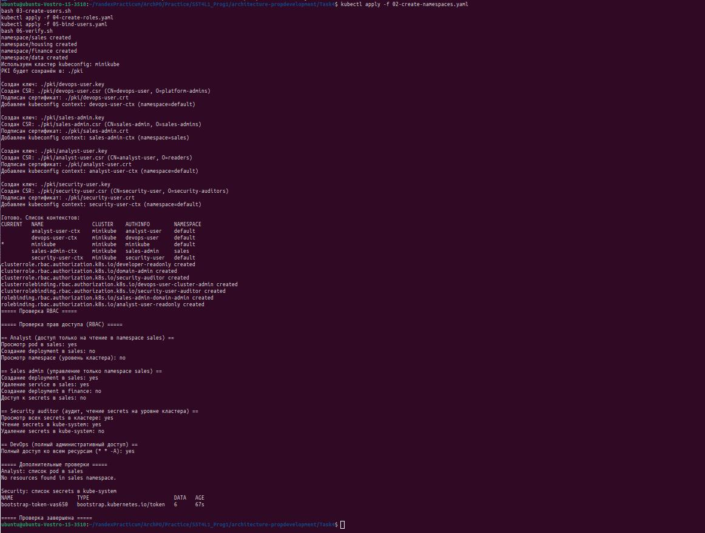

# Ролевая модель доступа к Kubernetes

| Роль | Права роли | Группы пользователей |
| --- | --- | --- |
| cluster-admin | Полный доступ ко всем ресурсам кластера Kubernetes: создание, изменение и удаление любых ресурсов, управление namespace, RBAC и secrets | DevOps / Platform team (devops-user) |
| domain-admin | Управление ресурсами внутри своего namespace (pods, deployments, services, configmaps, jobs, ingress): create, update, delete, get, list, watch. Доступ к secrets отсутствует | Продуктовые команды доменов (например, команда продаж — sales-admin) |
| developer-readonly | Только просмотр ресурсов в namespace: get, list, watch для pods, services, deployments, logs. Изменение и создание ресурсов запрещено | Разработчики, аналитики, менеджеры (analyst-user) |
| security-auditor | Просмотр ресурсов на уровне всего кластера, включая secrets: get, list, watch. Изменение и удаление ресурсов запрещено | Специалист по информационной безопасности (security-user) |


# Запуск скриптов и проверка

minikube start

```bash
kubectl apply -f 02-create-namespaces.yaml
bash 03-create-users.sh
kubectl apply -f 04-create-roles.yaml
kubectl apply -f 05-bind-users.yaml
bash 06-verify.sh
```


* 02-create-namespaces.yaml — создаёт sales/housing/finance/data
* 03-create-users.sh — добавляет пользователей и контексты в kubeconfig
* 04-create-roles.yaml — создаёт роли
* 05-bind-users.yaml — связывает пользователей с ролями
* 06-verify.sh — доказывает, что RBAC работает

# Сброс настроек
Для сброса настройк выполнить скрипт 

```bash
bash 00-cleanup.sh
```

P.S. при необходимости можно удалить кластер

```bash
minikube delete
```

# Результат работы
