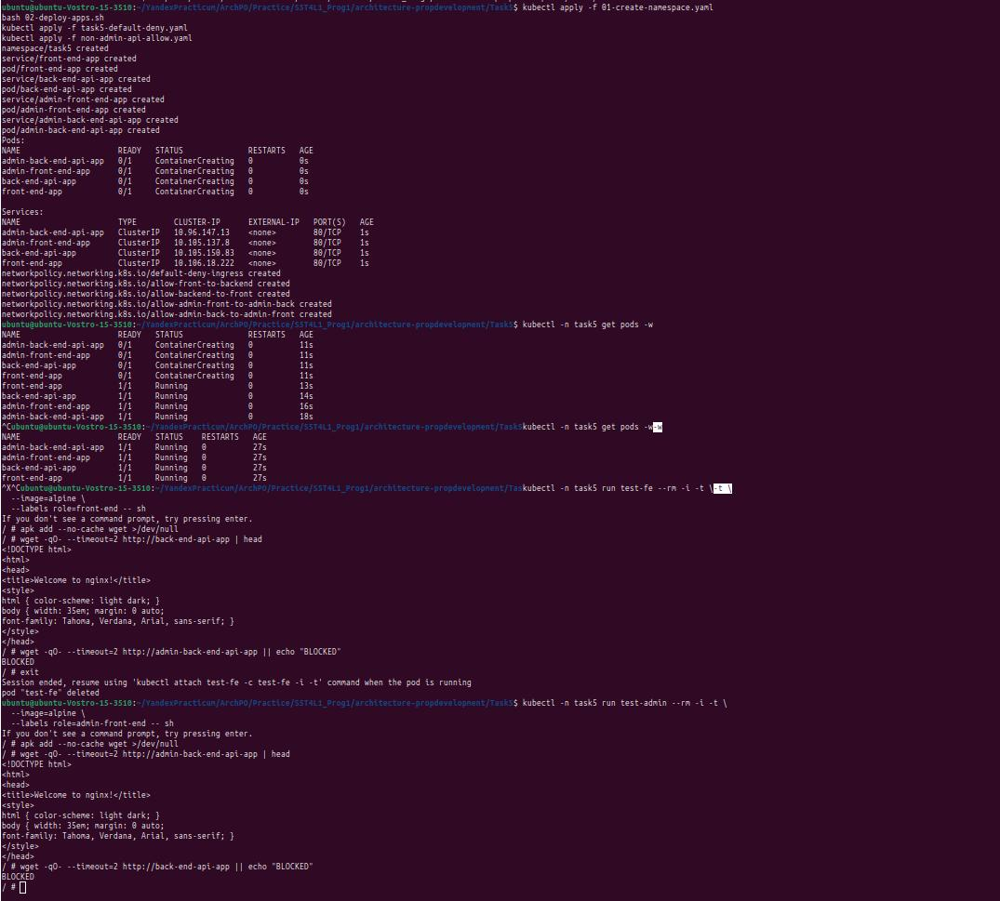

# Запуск скриптов

minikube delete
minikube start --cni=calico

```bash
kubectl apply -f 01-create-namespace.yaml
bash 02-deploy-apps.sh
kubectl apply -f task5-default-deny.yaml
kubectl apply -f non-admin-api-allow.yaml
```

# Проверка

* Шаг 1 — дождаться готовности pod’ов

```bash
kubectl -n task5 get pods -w
```

Когда все станут:

READY 1/1   STATUS Running


* Шаг 2 — тест разрешённого и запрещённого трафика


2.1 Проверка: front-end → back-end-api (ДОЛЖНО РАБОТАТЬ)

```bash
kubectl -n task5 run test-fe --rm -i -t \
  --image=alpine \
  --labels role=front-end -- sh
```

Внутри контейнера:

```bash
apk add --no-cache wget >/dev/null
wget -qO- --timeout=2 http://back-end-api-app | head
```

Ожидаем: HTML nginx

2.2 Проверка: front-end → admin-back-end-api (ДОЛЖНО БЫТЬ ЗАПРЕЩЕНО)

В том же контейнере:

```bash
wget -qO- --timeout=2 http://admin-back-end-api-app || echo "BLOCKED"
```
Ожидаем (нужно немного подождать):

BLOCKED

Выйти:

```bash
exit
```
2.3 Проверка: admin-front-end → admin-back-end-api (ДОЛЖНО РАБОТАТЬ)

```bash
kubectl -n task5 run test-admin --rm -i -t \
  --image=alpine \
  --labels role=admin-front-end -- sh
```

Внутри:

```bash
apk add --no-cache wget >/dev/null
wget -qO- --timeout=2 http://admin-back-end-api-app | head
```

Ожидаем: HTML nginx

2.4. Проверка: admin-front-end → back-end-api (ДОЛЖНО БЫТЬ ЗАПРЕЩЕНО)

```bash
wget -qO- --timeout=2 http://back-end-api-app || echo "BLOCKED"
```

Ожидаем:

BLOCKED

Выйти:

```bash
exit
```

# Сброс настроек

Для сброса настройк выполнить скрипт

```bash
bash 00-cleanup.sh
```
P.S. дополнительно можно удалить кластер

```bash
minikube delete
```

# Результат работы
